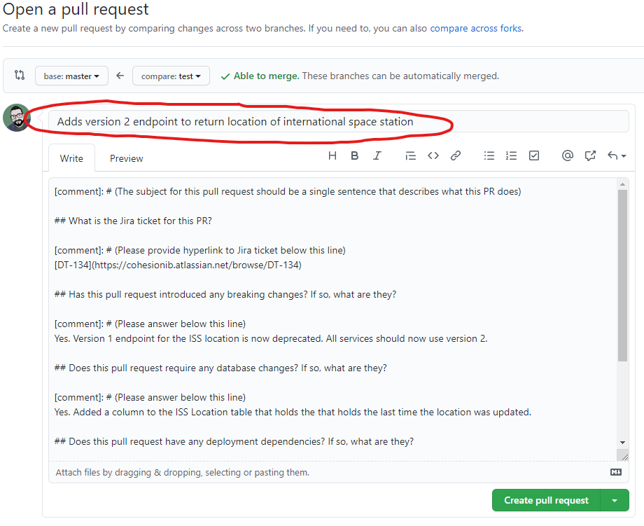

# .github

This is the organizational health repository. The files in this repository will be automatically pulled in to each repository across the cohesionIB organization.

**THIS IS A PUBLIC REPOSITORY. DO NOT COMMIT ANY SENSITIVE INFORMATION TO THIS REPOSITORY.**

## Pull Request Template

This is the default template for pull requests across the organization.

### How to Use PR Template

When a pull request is created, your pull request body will have an empty template that needs to be filled out by the engineer that's creating the PR. It will look like this:

Ensure your subject for the PR is one sentence that describes what the PR accomplishes:

Begin adding information to the PR like so:

When your PR is filled out, you will then submit it. It will look something along the lines of this:

The code reviewer and submitting engineer can then utlize the "Pull Request Checklist" to track what has been, and what needs to be, completed before the code review is passed and the PR is accepted:

